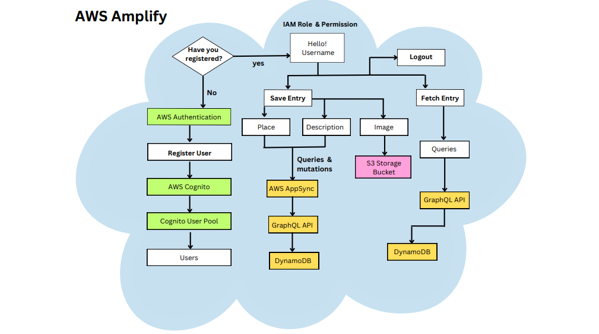

# Cloud-Powered Travel Diaries: A Full-Stack Amplify React Application

This project is a full-stack travel diary web application developed using AWS Amplify and React.js. The application enables users to register, log in, and create travel entries with descriptions and images. Leveraging AWS cloud services, this system demonstrates a serverless architecture to improve scalability, security, and performance while minimizing backend complexities.

# Features
1. User Registration and Authentication: Secure sign-up, sign-in, and session management using AWS Cognito.

2. Travel Entries Management: Users can create, save, and view travel journal entries.

3. Image Upload and Storage: Upload travel images to Amazon S3 and render them in the UI.

4. GraphQL API Integration: Efficient data communication between frontend and backend via AWS AppSync.

5. Database Storage: DynamoDB stores travel entry details such as place, description, and image URLs.

6. Serverless Deployment: Hosted on AWS Amplify with auto-scaling and minimal infrastructure management.

# Technology Stack
Frontend: React.js

Backend: AWS Amplify

Authentication: AWS Cognito

API: AWS AppSync (GraphQL)

Database: Amazon DynamoDB (NoSQL)

Storage: Amazon S3


# Architecture Overview
The system follows a serverless, cloud-native architecture:

User authentication is handled by AWS Cognito User Pools.

Frontend built with React interacts with the backend via GraphQL API calls using AWS AppSync.

Travel data is stored in DynamoDB, while images are uploaded and stored in S3.

IAM roles manage secure access and permissions across services.



# Installation & Setup
## Prerequisites
AWS Account

Node.js and npm installed

AWS Amplify CLI installed globally:
```bash
npm install -g @aws-amplify/cli
amplify configure
```
# Run Locally

Clone the repository:
```bash
git clone <your-repository-url>
cd <project-directory>
```

Initialize Amplify:
```bash
amplify init
```

Add AWS Services:
```bash
amplify add auth
amplify add api
amplify add storage
amplify push
```

Install dependencies:
```bash
npm install
```

Start the React App:
```bash
npm start
```

# Key Functionalities
## Authentication
Implemented using AWS Cognito for user sign-up, sign-in, and sign-out.

Amplify UI components integrated with React.

## Travel Journal Entry
Users can add new travel stories with location, description, and images.

Images are uploaded to S3 and linked in DynamoDB.

## Data Fetching & Display
Travel entries are fetched from DynamoDB via GraphQL queries.

Entries are displayed dynamically in the UI with uploaded images.